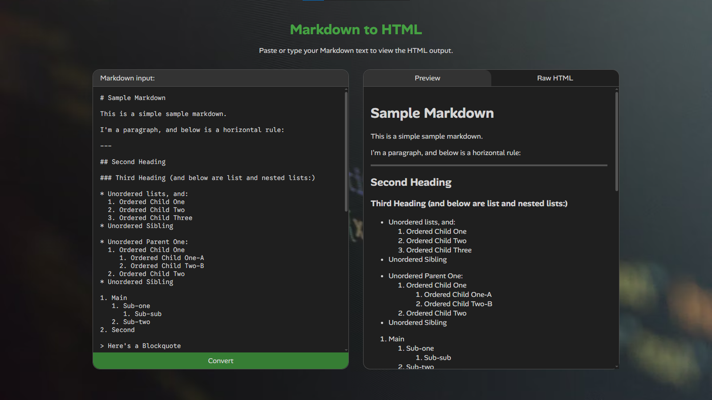
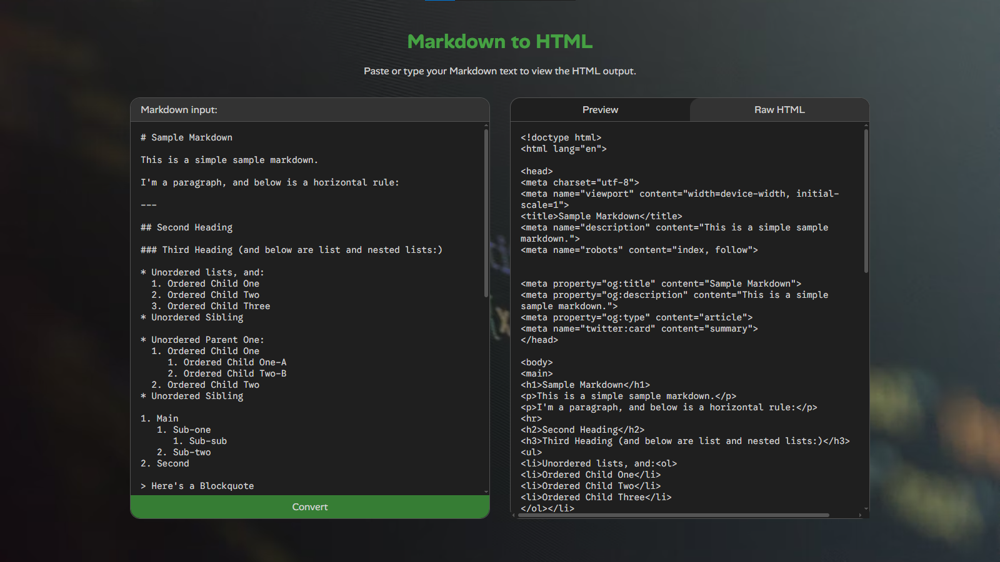

# Markdown to HTML Converter

A simple yet powerful **Markdown to HTML converter** that works both as a **command-line tool** and a **lightweight Flask web app**.  

It supports headings, lists, code blocks, inline formatting, links, images, tables, and even generates automatic SEO metadata.  




---

## ✨ Features

- **Markdown Elements**
  - Headings (`#`, `##`, etc.)
  - Paragraphs
  - Ordered (`1.`) and unordered lists (`-`, `+`, `*`)
  - Bold (`**bold**`), italic (`*italic*`), strikethrough (`~~strike~~`)
  - Inline code (`` `code` ``)
  - Links (`[text](url)`) and images (``)
  - Fenced code blocks (```lang)
  - Blockquotes (`> quote`)
  - Horizontal rules (`---`, `***`, `___`)
  - Tables (`| col | col |`)

- **Automatic SEO**
  - `<title>` from the first heading  
  - `<meta description>` from the first paragraph  
  - Open Graph and Twitter card tags for better sharing

- **Clean, well-structured HTML output**
- **Batch directory conversion**
- **Optional CSS and canonical link support**
- **Web mode** with live Markdown-to-HTML preview and raw output tab

---

## ⚙️ Installation

1. **Clone the repository**
   ```bash
   git clone https://github.com/datturbomoon/markdown-to-html.git
   cd markdown-to-html
   ```

2. **(Optional) Create a virtual environment**
   ```bash
   python -m venv .venv
   source .venv/bin/activate    # macOS/Linux
   .venv\Scripts\activate       # Windows
   ```

3. **Install dependencies**
   ```bash
   pip install -r requirements.txt
   ```
   If you don’t have a `requirements.txt`, just install Flask:
   ```bash
   pip install flask
   ```

---

## ▶️ Running the App

### **Command-Line Mode**

Convert single files, directories, or stdin Markdown input.

- Convert a single file:
  ```bash
  python app.py -i sample.md -o sample.html
  ```

- Convert all Markdown files in a directory:
  ```bash
  python app.py -d md_dir -D html_dir
  ```

- Read from stdin and output to stdout:
  ```bash
  cat sample.md | python app.py --stdout
  ```

- Include a CSS file or canonical link:
  ```bash
  python app.py -i input.md -o output.html --css style.css --canonical "https://example.com/page"
  ```

---

### **Web Mode**

Run a simple web interface to paste and preview Markdown.

1. Start the web server:
   ```bash
   python app.py --serve
   ```

2. Open your browser and go to:
   ```
   http://127.0.0.1:5000
   ```

The web interface includes:
- A live Markdown input area  
- Tabs for Preview and Raw HTML  
- Clean and responsive design  

---

## 🧩 Dependencies

Only Flask is required for web mode.

Install with:
```bash
pip install flask
```

CLI mode runs without Flask.

---

## 📄 Example

**Input (Markdown):**
```markdown
# My Page

This is a *sample* **Markdown** document.

- Item 1  
- Item 2  
  - Nested item

> "Markdown is simple but powerful."

```python
print("Hello, world!")
```

**Output (HTML):**
```html
<h1>My Page</h1>
<p>This is a <em>sample</em> <strong>Markdown</strong> document.</p>
<ul>
<li>Item 1</li>
<li>Item 2<ul><li>Nested item</li></ul></li>
</ul>
<blockquote>"Markdown is simple but powerful."</blockquote>
<pre><code class="language-python">print("Hello, world!")</code></pre>
```

---

## 🧠 How It Works

- Uses regular expressions for inline and block-level Markdown parsing.  
- Handles nested lists by indentation.  
- Converts Markdown into HTML with proper escaping and structure.  
- Automatically extracts metadata for SEO tags.  
- Optionally wraps output in a complete HTML document.

---

## 📦 Project Structure

```
app.py           # main script
README.md        # this file
sample.md        # sample Markdown file
md_dir/          # directory for batch conversion (contains 5 markdown text samples)
images/          # project snapshots image folder
```

---

## ⚖ License

MIT License — feel free to modify and use it in your own projects.
